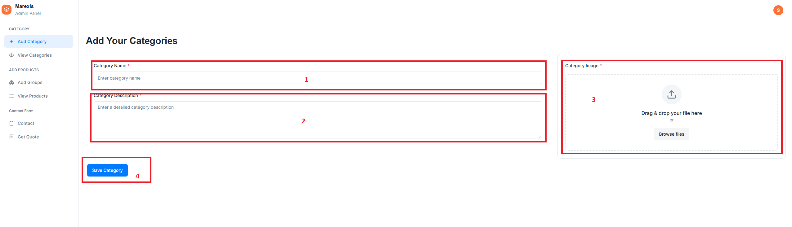
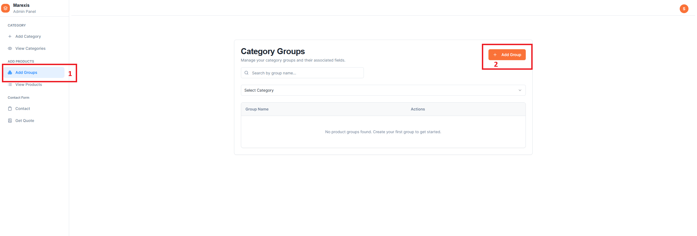
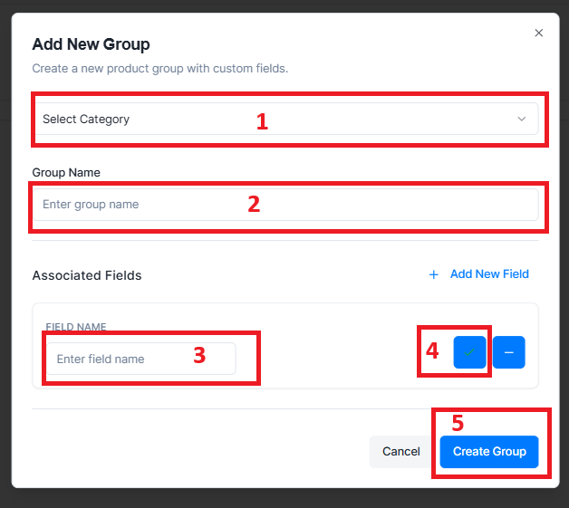
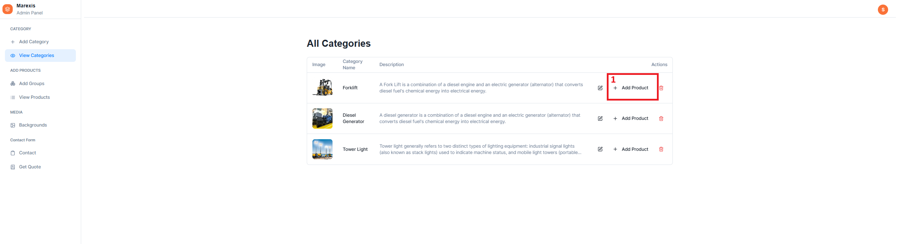
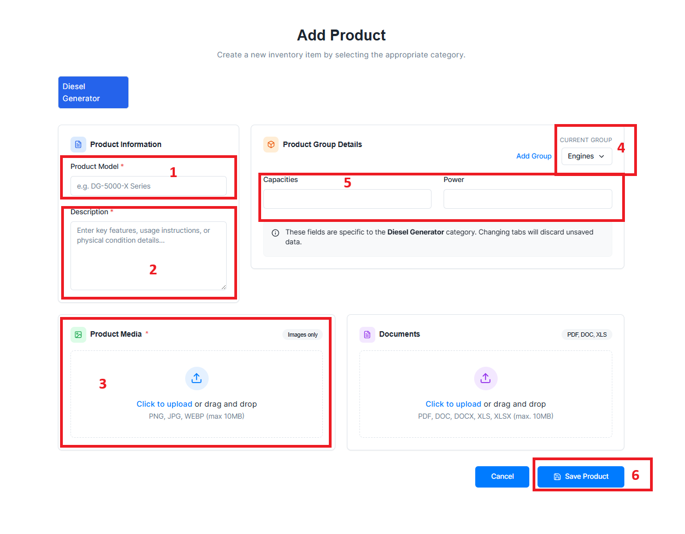

# Admin Panel User Guide: Adding Products

This tutorial guides you through the process of adding a full product using the Marexis Admin Panel. You do not need technical knowledge to follow these steps.

## 1. Accessing the Admin Panel

1.  Open your web browser and navigate to the admin dashboard.
2.  Enter your **Email/Username** and **Password** on the login screen.
3.  Click **Sign In** to access the dashboard.

---

## 2. Setting Up Categories

Before adding a product, you must ensure its Category exists. Categories organize items like "Forklifts" or "Excavators".

1.  On the Dashboard sidebar, locate and click **Category** (or "Add Category").
2.  Click the **Add New Category** button.
3.  **Fill in the details:**
    - **Category Name**: E.g., "Electric Forklift".
    - **Description**: A short description of this category.
    - **Image**: Upload a category image (required).
    
    

4.  Click **Save** or **Create Category**.

---

## 3. Configuring Groups & Fields

Each Product Category has specific technical specifications (e.g., "Rated Load", "Battery Capacity"). These are organized into **Groups**.

### Creating a Group
1.  Navigate to the **Group** section (often found under Category settings or a dedicated "Groups" menu).
2.  Click **Add Group** (or "+ New Group").
3.  **Select Category**: Choose the category this group belongs to (e.g., "Electric Forklift").
4.  **Group Name**: Enter a name like "General Specifications" or "Performance".

    

5.  Click **Save Group**.

### Adding Fields to a Group
Once a group exists, add the specific data fields.

1.  Find the Group you just created in the list.
2.  Click **Edit** or **Add Field** (often a small specific button or within the Group detail view).
3.  **Field Name**: Enter the label, such as:
    - "Rated Load (kg)"
    - "Lift Height (mm)"
    - "Travel Speed (km/h)"

    

4.  Click **Save Field**.
5.  _Repeat this for all specifications you want to track for this category._

---

## 4. Adding a Product

Now that the Categories and Fields are set up, you can add the actual product.

1.  Navigate to the **Products** page.
2.  Click the **Add Product** button.
3.  **Step 1: Basic Information**
    - **Select Category**: Choose the category (e.g., "Electric Forklift") from the dropdown. This will load the specific fields you created in Section 3.
    - **Model Name**: Enter the product model (e.g., "EF-2000 Pro").
    - **Description**: Enter marketing copy or details.
4.  **Step 2: Images**
    - Drag and drop product images into the upload area, or click to browse your computer.
5.  **Step 3: Specifications (Groups)**
    - You will see the Groups you created (e.g., "General Specifications").
    - Fill in the values for each Field (e.g., for "Rated Load", enter "2000").

    

6.  **Review & Save**
    - Check all information.
    - Click **Create Product** or **Publish**.

---

## Summary of Workflow

1.  **Category** (One-time setup) -> e.g., "Forklift"
2.  **Groups** (One-time setup) -> e.g., "Performance"
3.  **Fields** (One-time setup) -> e.g., "Speed", "Load"
4.  **Product** (Daily usage) -> Add "Model X" and fill in "Speed" and "Load".
